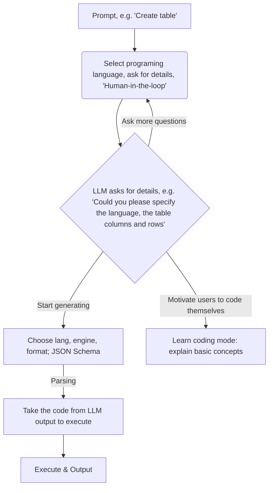

# coding-assitant

```mermaid
flowchart TD
    A[Prompt, e.g. 'Create table'] -->B(Select programing language, ask for details, 'Human-in-the-loop')
    B --> C{LLM asks for details, e.g. 'Could you please specify the language, the table columns and rows'}
    C -->|Ask more questions|B
    C -->|Start generating| E[Choose lang, engine, format; JSON Schema]
    C -->|Motivate users to code themselves| F[Learn coding mode: explain basic concepts]
    E -->|Parsing|G[Take the code from LLM output to execute]
    G --> H[Execute & Output]
```
